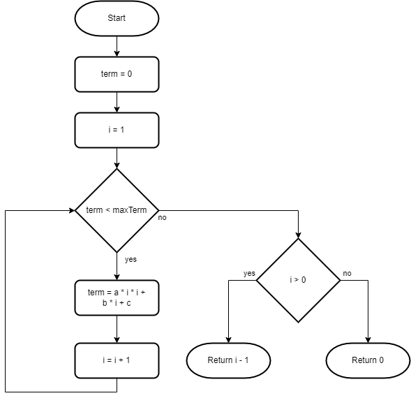

# For Statements


## Task Description

The task has sixteen tasks in six sections. Each task is a small coding exercise.

Use the only `for` and `if-else` statements in this task. Using `while` or `do-while` iteration statements is not required.


### Arithmetic Sequences

The arithmetic sequence formula is given as,

$a_{n} = a+(n-1)\cdot{d}$

where,
* $a_{n}$ is the nth term,
* $a$ is the first term, and
* $d$ is the common difference.

#### Task 1

Open the [ArithmeticSequences.cs](ForStatements/ArithmeticSequences.cs) file.

Implement the method that returns sum of an arithmetic sequence terms if the common difference is 1.

$$\sum_{i=1}^{n} a+(i-1)\cdot{1}=\sum_{i=0}^{n-1} a+i$$

For the arithmetic sequence ${5, 6, 7, 8, 9, ...}$ the sum of the first five elements is 35 (5 + 6 + 7 + 8 + 9).

The algorithm you have to implement is shown on the flowchart diagram below. The flowchart notation has no special symbol for a `for` statement, therefore a decision block is used in the diagram.


Read and analyze the diagram, add the code to the _SumArithmeticSequenceTerms1_ method. 

1. Declare and initialize the _sum_ and the _i_ variables. Add the *return* statement  

```cs
public static int SumArithmeticSequenceTerms1(int a, int n)
{
    int sum = 0;

    return sum;
}
```

2. Add the [for statement](https://docs.microsoft.com/en-us/dotnet/csharp/language-reference/statements/iteration-statements#the-for-statement) that iterates until _i_ is less than _n_. The `for` statement has three elements - _initializer_, _condition_ and _iterator_ sections.

```cs
public static int SumArithmeticSequenceTerms1(int a, int n)
{
    int sum = 0;

    for (int i = 0; i < n; i = i + 1)
    {
    }

    return sum;
}
```


3. Add the sum calculation.

```cs
public static int SumArithmeticSequenceTerms1(int a, int n)
{
    int sum = 0;

    for (int i = 0; i < n; i = i + 1)
    {
        sum = sum + a + i;
    }

    return sum;
}
```

4. Replace the assignment with addition assignment operator *+=*

```cs
public static int SumArithmeticSequenceTerms1(int a, int n)
{
    int sum = 0;

    for (int i = 0; i < n; i = i + 1)
    {
        sum += a + i;
    }

    return sum;
}
```

5. Replace the assignment with increment operator *++*

```cs
public static int SumArithmeticSequenceTerms1(int a1, int n)
{
    int sum = 0;

    for (int i = 0; i < n; i++)
    {
        sum += a + i;
    }

    return sum;
}
```

#### Task 2

Implement the method that returns the sum of an arithmetic sequence elements when the first term is 47 and the common difference is 13.

$$\sum_{i=1}^{n} 47+(i-1)\cdot{13}=\sum_{i=0}^{n-1} 47+i\cdot{13}$$

Beginner programmers often put number literals in their code like this:

```cs
public static int SumArithmeticSequenceTerms2(int n)
{
    int sum = 0;

    for (int i = 0; i < n; i++)
    {
        sum += 47 + (i * 13);
    }

    return sum;
}
```

Experienced programmers consider using number literals with unexplained meaning as a *bad practice*. They call such literals [magic numbers](https://en.wikipedia.org/wiki/Magic_number_(programming)).

If you have a magic number in your code, [replace it with a symbolic constant](https://refactoring.guru/replace-magic-number-with-symbolic-constant):

```cs
public static int SumArithmeticSequenceTerms2(int n)
{
    const int firstTerm = 47;
    const int commonDifference = 13;

    int sum = 0;

    for (int i = 0; i < n; i++)
    {
        sum += firstTerm + (i * commonDifference);
    }

    return sum;
}
```

#### Task 3

Implement the method that returns the sum of an arithmetic sequence elements when the common difference is 5.

$$\sum_{i=1}^{n} a+(i-1)\cdot{5}=\sum_{i=0}^{n-1} a+i\cdot{5}$$

Introduce a constant to avoid magic numbers in your code.


### Factorial

The *factorial* of a non-negative integer $n$, denoted by $n!$, is the product of all positive integers less than or equal to $n$.

$$n!=\prod_{i=1}^{n}i=1\cdot...\cdot(n-1)\cdot{n}$$

#### Task 4

Open the [Factorial.cs](ForStatements/Factorial.cs) file.

Implement the method that returns the factorial of the number $n!$ using the `for` statement.

#### Task 5

Implement the method that calculates the factorial of the number $n!$ and returns the sum of its digits using the `for` statement.

$10!=1\cdot{2}\cdot{3}\cdot{4}\cdot{5}\cdot{6}\cdot{7}\cdot{8}\cdot{9}\cdot{10}=3628800$

The sum of digits of 3,628,800 is 27 (3+6+2+8+8).

Use the remainder operator `%` to get the last digit of factorial of a number.

The expression in the condition section may use any variable, not only variables mentioned in the initializer or iterator sections.

```cs
for (int sum = 0; product > 0; product = product / 10)
{
    sum += product % 10;
}
```

Use the *compound assignment expression* instead of the division operator.

```cs
for (int sum = 0; product > 0; product /= 10)
{
    sum += product % 10;
}
```

You can leave any section empty if this makes sense for your algorithm:

```cs
int sum = 0;

for (; product > 0; product /= 10)
{
    sum += product % 10;
}

return sum;
```


### Quadratic Sequences

A *quadratic sequence* is an ordered set of terms that follows a rule based on the sequence $n^2=1, 4, 9, 16, 25,$ ...

The quadratic sequence formula is:

$a_{n} = a\cdot{n^2}+b\cdot{n}+c$

where,
* $a_{n}$ is the nth term, and
* $a$, $b$ and $c$ are constants.

#### Task 6

Open the [QuadraticSequences.cs](ForStatements/QuadraticSequences.cs) file.  

Implement the method that returns the number of the quadratic sequence terms that are less than or equals to the _maxTerm_.

The quadratic sequence with nth term $a_{n}=3\cdot{n^2}+5\cdot{n}+7$ is $\{ 15, 29, 49, 75, 107, 145, ...\}$.

If _maxTerm_ is 29, the number of terms is 2 (15 and 29 terms). If _maxTerm_ is 107, the number of terms is 5 (15, 29, 49, 75 and 107 terms).

The algorithm you have to implement is shown on the flowchart diagram below.


